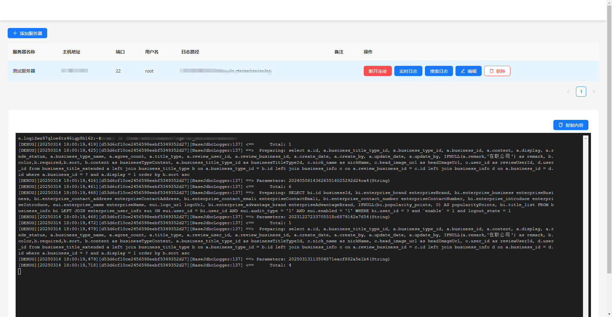
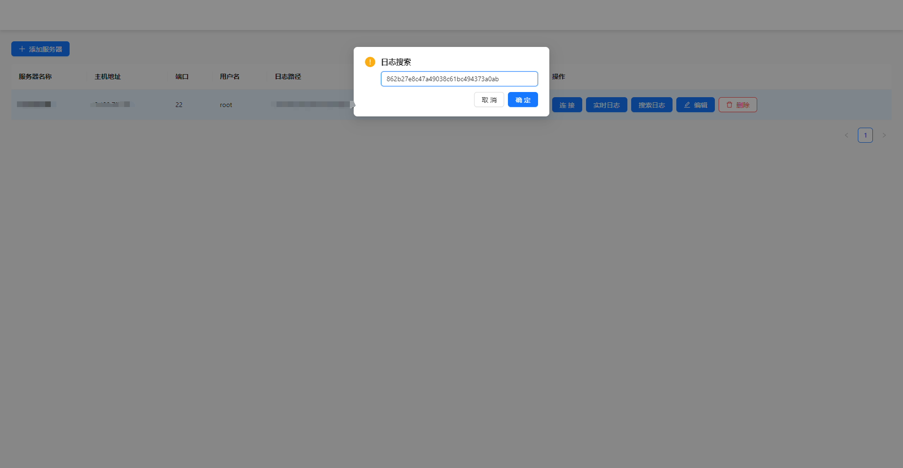
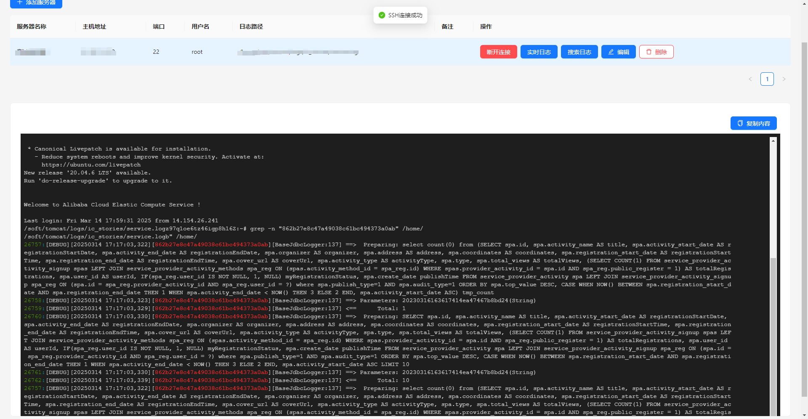
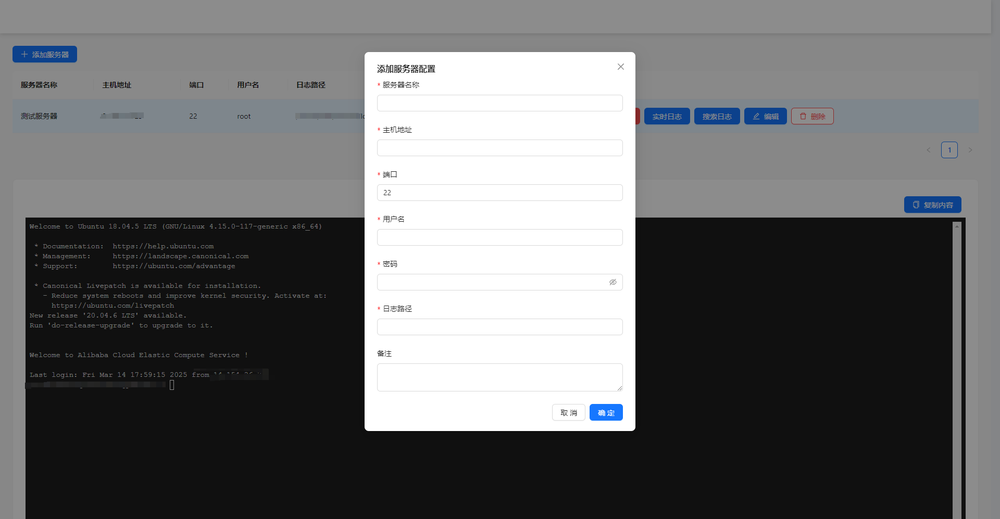
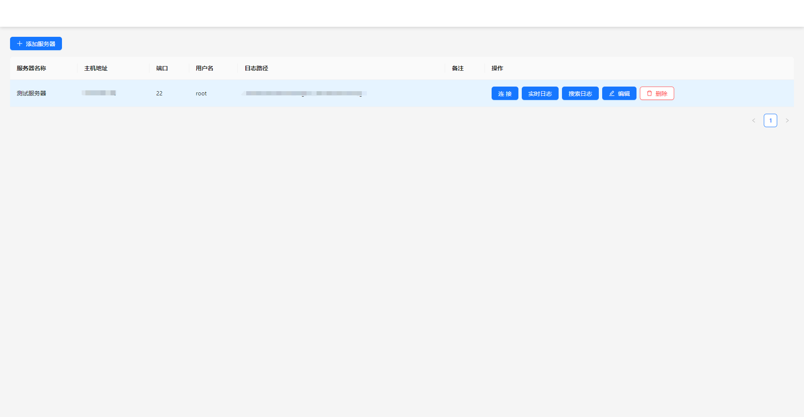
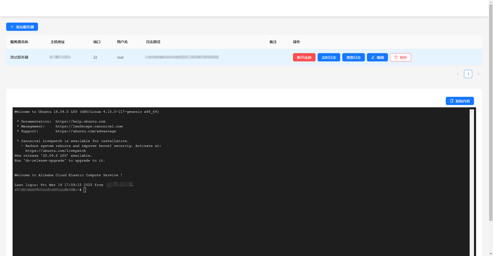

# 远程服务器日志查询工具

欢迎使用 **远程服务器日志查询工具**，一个强大且高效的工具，专为开发者和系统管理员设计，帮助您轻松管理和监控远程服务器日志。

## 功能特性

- **实时日志查看**：通过 SSH 连接，实时查看远程服务器的日志输出，帮助您快速定位问题。
  

- **日志搜索**：支持关键字搜索功能，快速查找日志中的相关信息。
  
  

- **多服务器管理**：轻松添加、编辑和删除服务器配置，支持多服务器切换。
  

- **直观的用户界面**：基于 Ant Design 的现代化 UI，提供流畅的用户体验。
  

- **安全可靠**：通过 Electron 和 SSH 协议，确保数据传输的安全性。
  

## 快速开始

### 环境要求

- Node.js 14.x 或更高版本
- npm 6.x 或更高版本

### 安装

#### 开发环境

1. 克隆本仓库到本地：

   ```bash
   git clone https://github.com/123xiao/remote-log-viewer.git
   cd remote-log-viewer
   ```

2. 安装依赖：

   ```bash
   npm install
   ```

3. 启动应用：

   ```bash
   npm preview
   ```

#### Windows 安装包

1. 构建 Windows 安装包：

   ```bash
   npm run build:win
   ```

2. 构建完成后，可以在 `dist` 目录下找到生成的安装包文件（.exe）。

3. 双击安装包文件，按照安装向导进行安装。

安装包特点：

- 支持自定义安装目录
- 自动创建桌面快捷方式
- 添加开始菜单项
- 支持卸载程序

## 使用指南

1. 启动应用后，点击"添加服务器"按钮，输入服务器的相关信息。
2. 在服务器列表中，选择一个服务器并点击"连接"按钮以建立 SSH 连接。
3. 使用"实时日志"按钮查看实时日志输出，或使用"搜索日志"功能查找特定信息。

## 贡献

欢迎贡献代码和建议！请阅读 [CONTRIBUTING.md](CONTRIBUTING.md) 了解更多信息。

## 许可证

本项目采用 MIT 许可证。详情请参阅 [LICENSE](LICENSE)。

## 联系我们

如有任何问题或建议，请通过 [GitHub Issues](https://github.com/123xiao/remote-log-viewer/issues) 联系我们。

---

**远程服务器日志查询工具**，让您的服务器管理更轻松、更高效！
